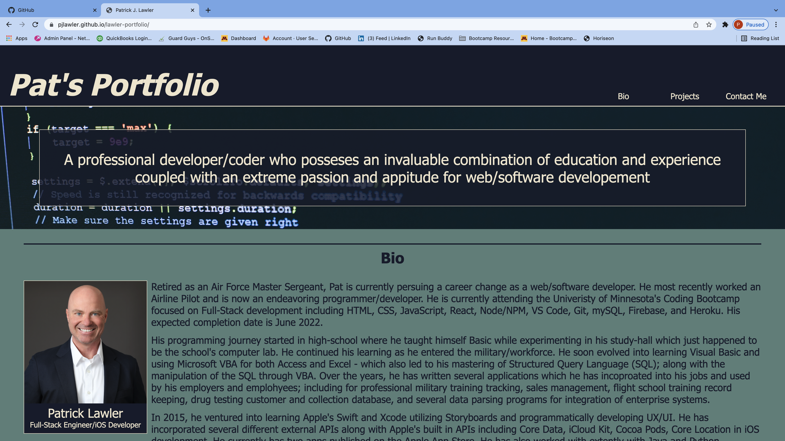

 
 # Pat's Portfolio
 ## *Table of Contents*
1. [Description](#description)
2. [Questions](#questions)
3. [License Info](#license-info)

 _ _ _
 ## *Description*
 ### A compilation of the coding applications that I have developed/co-developed. 
 
 _ _ _
 
 
 
 
 ## *Questions*
 ###   For questions or comments concerning this project please contact, Patrick Lawler, the author, owner and manager the work via either github or email. Links for each are listed below.
 - github: [pjlawler](https://github.com/pjlawler)
 - email: patlaw777@icloud.com
 _ _ _
 ## *License Info*
    Copyright Ⓒ 2022 Patrick Lawler
      
    Permission is hereby granted, free of charge, to any person obtaining a copy of this software and associated documentation files (the "Software"), to deal in the Software without restriction, including without limitation the rights to use, copy, modify, merge, publish, distribute, sublicense, and/or sell copies of the Software, and to permit persons to whom the Software is furnished to do so, subject to the following conditions:
    
    The above copyright notice and this permission notice shall be included in all copies or substantial portions of the Software.
    
    THE SOFTWARE IS PROVIDED "AS IS", WITHOUT WARRANTY OF ANY KIND, EXPRESS OR IMPLIED, INCLUDING BUT NOT LIMITED TO THE WARRANTIES OF MERCHANTABILITY, FITNESS FOR A PARTICULAR PURPOSE AND NONINFRINGEMENT. IN NO EVENT SHALL THE AUTHORS OR COPYRIGHT HOLDERS BE LIABLE FOR ANY CLAIM, DAMAGES OR OTHER LIABILITY, WHETHER IN AN ACTION OF CONTRACT, TORT OR OTHERWISE, ARISING FROM, OUT OF OR IN CONNECTION WITH THE SOFTWARE OR THE USE OR OTHER DEALINGS IN THE SOFTWARE.